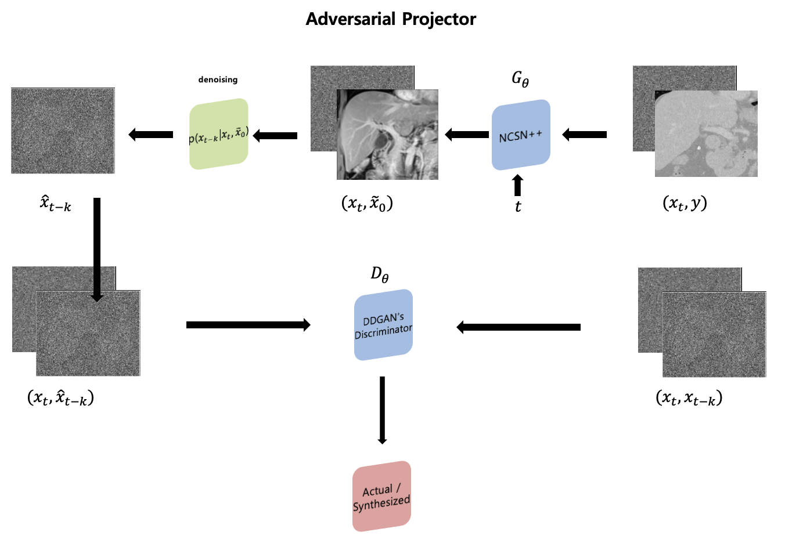

# Bi-Directional Enhancement of Medical Images using MRI-T1 and CT Data:An Adversarial Diffusion Approach

<figure>
    
    <figcaption>Adversarial Diffusion Process</figcaption>
</figure>


<figure>
    
    <figcaption>Adversarial Diffusion Projector</figcaption>
</figure>

## Abstract
Medical imaging plays a crucial role in enhancing the accuracy of diagnosis. In particular, some tissues can be more accurately identified through multiple imaging modalities. If an image obtained from one imaging technique can be transformed into another modality, it would lead to a more efficient diagnostic process in the medical field. In this study, we conducted research on synthesizing the bile duct using CT scans into MRI-T1 images. Due to differences in imaging techniques, the bile duct is less distinguishable in CT scans but appears more prominently in MRI-T1 images. By obtaining MRI-T1 image information solely from CT scans, we anticipate time and cost savings in the medical field. This research highlights the limitations of prior neural network-based studies on the translation from CT to MRI and proposes a solution using a diffusion model.

## Train

<br />

```
python3 train.py --image_height 400 --image_width 480 --exp exp_syndiff --num_channels 2 --num_channels_dae 64 --ch_mult 1 1 2 2 4 --num_timesteps 4 --num_res_blocks 2 --batch_size 1 --contrast1 CT --contrast2 MRT1 --num_epoch 100 --ngf 64 --embedding_type positional --use_ema --ema_decay 0.999 --r1_gamma 1. --z_emb_dim 256 --lr_d 1e-4 --lr_g 1.6e-4 --lazy_reg 10 --num_process_per_node 3 --save_content --local_rank 0 --input_path ../dataset/train --output_path ./output_epoch50_gpu4_400x480/for/results --port_num 5000
```

## Test

<br />

```
python3 test.py --image_height 400 --image_width 480 --exp exp_syndiff --num_channels 2 --num_channels_dae 64 --ch_mult 1 1 2 2 4 --num_timesteps 4 --num_res_blocks 2 --batch_size 1 --embedding_type positional  --z_emb_dim 256 --contrast1 CT --contrast2 MRT1 --which_epoch 20 --gpu_chose 4 --input_path ../dataset/train --output_path /output_epoch50_gpu4_400x480/for/results
```


## Author

Han Jang - Korea Institute of Science and Technology, Seoul, South Korea.


## Reference
- https://github.com/icon-lab/SynDiff
- https://arxiv.org/abs/2207.08208
